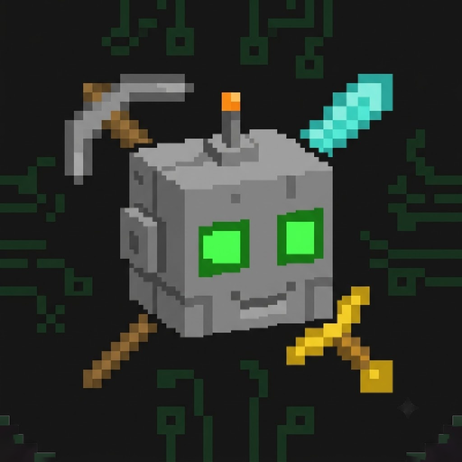

<p align="center">
  
</p>

<h1 align="center">MineMate AI</h1>

<p align="center">
  <strong>AI-Powered Minecraft Staff Bot</strong><br>
  An intelligent Minecraft bot that joins servers as a player while acting as an AI assistant for all players.
</p>

<p align="center">
  
  
  
  
  
  
  
  
</p>

---

## Overview

MineMate AI is a desktop application built with **Tauri v2** (Rust backend + React frontend) that creates an AI-powered Minecraft bot. Unlike traditional bots that only execute predefined commands, MineMate understands natural language, remembers the world, performs complex building tasks, assists players, and automates repetitive server operations.

The bot combines deterministic automation with an LLM (via NVIDIA NIM API) so that repetitive tasks remain reliable while reasoning tasks become intelligent.

## Features

- **Natural Language Understanding** - Players chat with the bot in plain English
- **AI Tool Calling** - LLM chooses from 14 approved tools (move, mine, build, craft, fight, etc.)
- **Auto-Reconnect** - Automatically reconnects after disconnects
- **Starter Kits** - Automatically gives items on player respawn
- **Blueprint Building** - Build structures from JSON blueprints
- **Memory System** - Remembers players, locations, and history in SQLite
- **Live Dashboard** - Real-time bot status, chat log, and task queue
- **Pixel-Brutalism UI** - Minecraft-inspired admin control panel

## Tech Stack

| Component | Technology |
|-----------|------------|
| Language | Rust (nightly) |
| Desktop Framework | Tauri v2 |
| Frontend | React + TypeScript + Vite |
| Minecraft Client | Azalea |
| AI | NVIDIA NIM API (Llama 3.3 70B / Qwen / DeepSeek) |
| Database | SQLite |
| Configuration | TOML |
| Design System | Pixel-Brutalism (Minecraft UI) |

## Prerequisites

- **Rust nightly** (required by Azalea for `#![feature(portable_simd)]`)
  ```bash
  rustup install nightly
  rustup default nightly
  ```
- Node.js 18+
- Tauri CLI

## Project Structure

```
minemate/
├── src-tauri/                 # Rust backend
│   ├── src/
│   │   ├── ai/               # NVIDIA NIM client, tools, context builder
│   │   ├── bot/              # Azalea client wrapper, event system
│   │   ├── commands/         # Tauri IPC commands
│   │   ├── config/           # TOML config management
│   │   ├── executor/         # Tool execution, automations, security
│   │   └── memory/           # SQLite database operations
│   └── Cargo.toml
├── src/                       # React frontend
│   ├── components/
│   │   ├── shell/            # TopNavBar, SideNavBar
│   │   ├── dashboard/        # HUD, PlayerList, EventLog
│   │   ├── chat/             # Chat messages, input
│   │   ├── config/           # Settings panel
│   │   └── tasks/            # Task queue
│   ├── hooks/                # Tauri IPC hooks
│   └── styles/               # Pixel-Brutalism CSS
├── config/                    # Default TOML config
└── database/                  # SQLite database
```

## Getting Started

```bash
# Clone the repository
git clone https://github.com/pamod-madubashana/BotCraft.git
cd BotCraft

# Install Rust nightly
rustup install nightly
rustup default nightly

# Install frontend dependencies
npm install

# Run in development mode
cargo tauri dev
```

### Configuration

Edit `config/default.toml` to set your server details and NVIDIA NIM API key:

```toml
[server]
address = "your-server.com"
port = 25565

[ai]
api_key = "nvapi-your-api-key-here"
model = "meta/llama-3.3-70b-instruct"
```

## AI Tools

The bot can perform these actions via LLM tool calling:

| Tool | Description |
|------|-------------|
| `move_to` | Move to coordinates |
| `follow` | Follow a player |
| `mine` | Mine blocks |
| `craft` | Craft items |
| `attack` | Attack hostiles |
| `place_block` | Place blocks |
| `build_structure` | Build from blueprint |
| `reply` | Chat response |
| `execute_command` | Server command (OP) |
| `scan_area` | Scan nearby blocks |
| `give_item` | Give items to players |
| `teleport` | Teleport to location |
| `sort_chests` | Organize storage |
| `protect_player` | Guard a player |

## Development Roadmap

- [x] Phase 1: Project scaffolding with Tauri + React
- [x] Phase 2: Core bot with Azalea integration
- [x] Phase 3: AI Engine with NVIDIA NIM streaming
- [x] Phase 4: Memory system with SQLite
- [x] Phase 5: Complete UI pages with Tauri IPC
- [x] Phase 6: Security & audit logging
- [ ] Phase 7: Multi-bot coordination

## Contributing

Contributions are welcome! Please open an issue first to discuss what you would like to change.

## License

MIT License - see [LICENSE](LICENSE) for details.

## Acknowledgments

- [Azalea](https://github.com/azalea-rs/azalea) - Minecraft client framework
- [Tauri](https://tauri.app/) - Desktop app framework
- [NVIDIA NIM](https://build.nvidia.com/) - AI inference API
